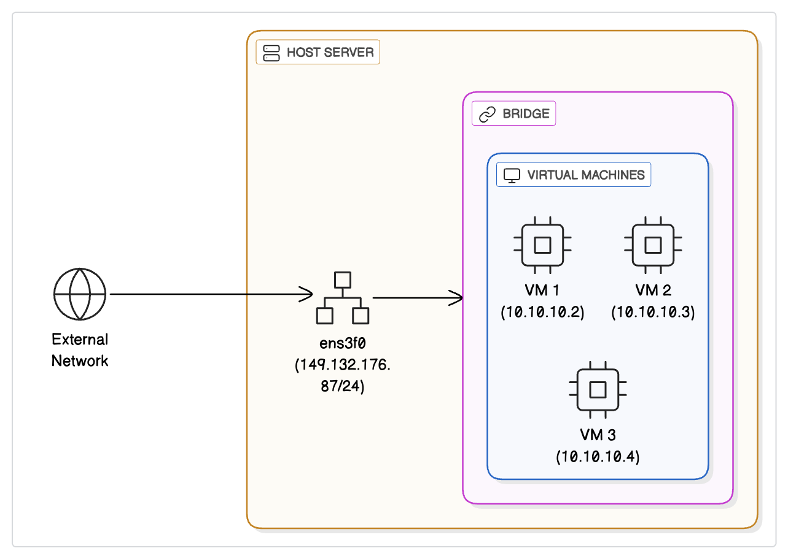

# Host Network Configuration Documentation

This document explains the network configuration defined in the `/etc/network/interfaces` file for a **Proxmox host**.

---

## Network Topology



The diagram above shows:

- `ens3f0`: public-facing NIC with static IP and gateway
- `vmbr0`: internal virtual bridge used by VMs
- `10.10.10.0/24`: internal subnet for virtual machines
- NAT and Port Forwarding via `iptables`
- IP Forwarding and Proxy ARP enabled for routing

---

:::danger

This section of the documentation is intended exclusively for the maintenance team. If you are not a member of the maintenance team and need to configure traffic redirection using NAT rules, please contact the maintenance team for assistance.

:::


## File Overview

The configuration manages multiple network interfaces including physical NICs (`ens3f0`, `ens3f1`, etc.) and a virtual bridge interface (`vmbr0`) used for virtual machine networking. It also includes IP forwarding and NAT setup for routing and port forwarding.

---

## Configuration Breakdown

:::note

This configuration should not be modified unless there are significant changes to the network infrastructure.

:::

```bash
auto lo
iface lo inet loopback
auto lo: Automatically brings up the loopback interface at boot.
```

- **iface lo inet loopback**: Defines lo (loopback) interface with IPv4 loopback settings. This interface is used for internal communication within the host. 


```bash
auto ens3f0
iface ens3f0 inet static 
        address 149.132.176.87/24
        gateway 149.132.176.1

        # Port Forwarding Rules
        post-up echo 1 > /proc/sys/net/ipv4/ip_forward
        post-up echo 1 > /proc/sys/net/ipv4/conf/ens3f0/proxy_arp
```

- **auto ens3f0**: Automatically enable the network interface ens3f0 on boot.

- **iface ens3f0 inet static**: Configure ens3f0 with a static IP address.

- **address 149.132.176.87/24**: Assigns a static IPv4 address with subnet mask /24 (255.255.255.0).

- **gateway 149.132.176.1**: Sets the default gateway for external network access.

post-up commands:

- **echo 1 > /proc/sys/net/ipv4/ip_forward**: Enables IPv4 forwarding at the kernel level, allowing the host to route - packets between interfaces.

- **echo 1 > /proc/sys/net/ipv4/conf/ens3f0/proxy_arp**: Enables proxy ARP on ens3f0 allowing the host to respond to ARP requests on behalf of other machines (useful in bridged or NAT setups).

```bash
iface ens3f1 inet manual
iface ens3f2 inet manual
iface ens3f3 inet manual
These three interfaces (ens3f1, ens3f2, ens3f3) are configured manually without automatic IP assignment.
```

They are typically used for bridging or other advanced networking setups, or simply kept down until configured.

```bash
auto vmbr0
iface vmbr0 inet static
        address 10.10.10.1/24
        bridge-ports none
        bridge-stp off
        bridge-fd 0

        # Network Masquerading Rules
        post-up   echo 1 > /proc/sys/net/ipv4/ip_forward
        post-up   iptables -t nat -A POSTROUTING -s '10.10.10.0/24' -o ens3f0 -j MASQUERADE
        post-down iptables -t nat -D POSTROUTING -s '10.10.10.0/24' -o ens3f0 -j MASQUERADE

        # NATting Rules
        # EXAMPLE server:10099 to local 10.10.10.99:22
        #post-up iptables -t nat -A PREROUTING -p tcp -i ens3f0 --dport 10099 -j DNAT --to 10.10.10.99:22
        #post-down iptables -t nat -D PREROUTING -p tcp -i ens3f0 --dport 10099 -j DNAT --to 10.10.10.99:22
```

- **auto vmbr0**: Automatically bring up the bridge interface vmbr0 on boot.

- **iface vmbr0 inet static**: Configure vmbr0 with a static IPv4 address.

- **address 10.10.10.1/24**: Assigns the bridge IP address within a private subnet (10.10.10.0/24).

- **bridge-ports none**: This bridge has no physical interfaces attached directly to it, commonly used to create an isolated virtual network for VMs.

- **bridge-stp off**: Disables Spanning Tree Protocol (STP) to prevent network loops; useful in simple bridge setups.

- **bridge-fd 0**: Sets bridge forwarding delay to 0 (immediate forwarding).

## Network Masquerading (NAT)

- **post-up echo 1 > /proc/sys/net/ipv4/ip_forward**: Enable IP forwarding for routing packets from the bridge network to the outside network.

- **post-up iptables -t nat -A POSTROUTING -s '10.10.10.0/24' -o ens3f0 -j MASQUERADE**: Adds an iptables rule to masquerade (perform NAT) for all traffic from the VM subnet (10.10.10.0/24) going out via ens3f0 (the external network interface).

- **post-down iptables -t nat -D POSTROUTING -s '10.10.10.0/24' -o ens3f0 -j MASQUERADE**: Removes the NAT masquerade rule when the bridge is brought down.

## Example Port Forwarding Rules (commented out)
These are example iptables rules for forwarding external TCP ports to specific IPs inside the VM subnet:

```bash
post-up iptables -t nat -A PREROUTING -p tcp -i ens3f0 --dport 10099 -j DNAT --to 10.10.10.99:22
post-down iptables -t nat -D PREROUTING -p tcp -i ens3f0 --dport 10099 -j DNAT --to 10.10.10.99:22
```
Forward TCP connections coming to external interface ens3f0 on port 10099 to internal IP 10.10.10.99 on port 22 (SSH).

After editing the network interface configuration file, apply the changes using:

```bash
ifreload -a
```

This will reload all network interfaces and apply associated post-up and post-down commands, including iptables rules.

To confirm that the NAT rule has been successfully added:

```bash
iptables -t nat -L -n -v
```

Check for a rule under the PREROUTING chain that matches the expected port and destination IP.

:::danger

To flush all NAT rules (this will remove all existing port forwarding and NAT rules):

```bash
sudo iptables -t nat -F
```

This action is irreversible and affects all active NAT rules. Only use this if you're certain about resetting your NAT table.

:::